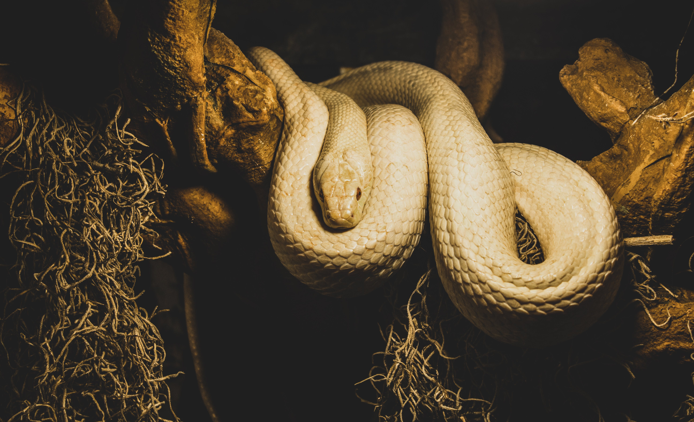

<h1 align="center">100 Days Of Learning Python</h1>

---

  

## 📚 Introduction

My goal with this project is to dedicate 100 days to solidify my knowledge in Python. 

## 🎯 Goals

- Gain a solid foundation in Python programming language
- Learn and practice different Python libraries and frameworks
- Develop real-world applications using Python
- Improve coding style and best practices
- Enhance problem-solving skills
- Prepare for the PCAP™ – Certified Associate in Python Programming Certification.

## 📈 Progress

I will be updating this README file daily to track my progress and share my learnings with others. Each day, I will provide a brief summary of what I have learned, any challenges I encountered, and the projects I have worked on.

## 📚 Learning Resources

For this 100-day Python learning journey, I will primarily follow the course "100 Days of Code: The Complete Python Pro Bootcamp for 2023". However, I will also supplement my learning with various resources such as online tutorials, documentation, books, and coding communities. 
By utilizing these resources, I aim to enhance my learning experience and gain a comprehensive understanding of Python programming.

## 🎉 Conclusion

I am excited to embark on this 100-day Python learning journey and look forward to the growth and improvement that will come with it. I hope that by documenting my progress, I can inspire and motivate others to start their own learning journeys.